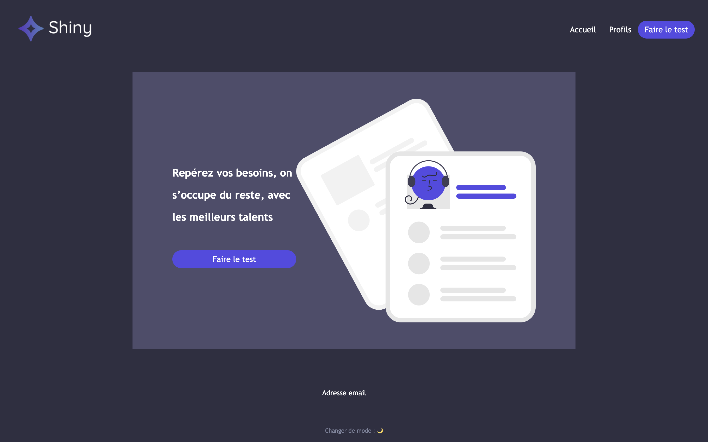
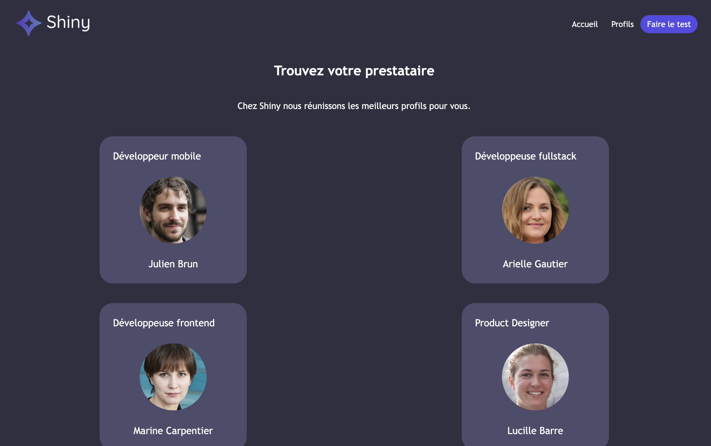
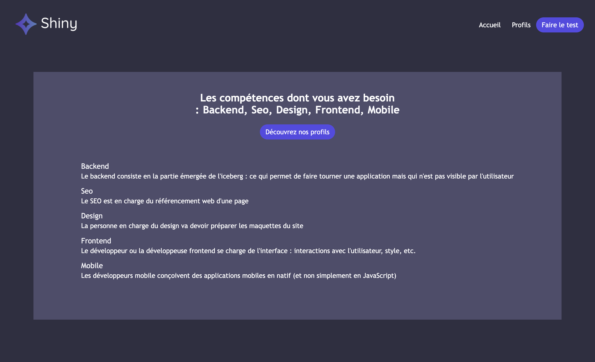
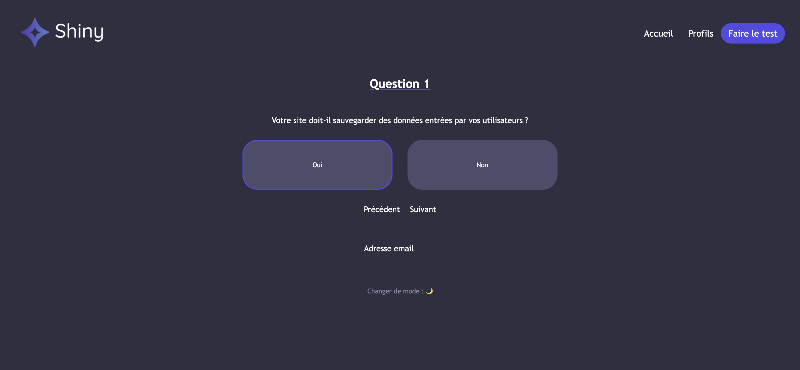
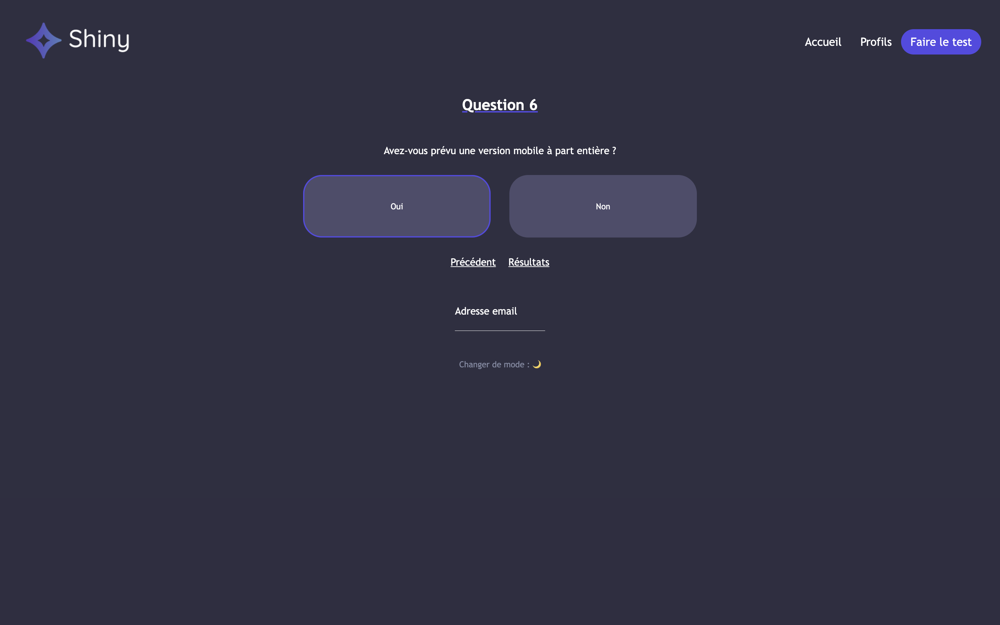

# Shiny Agency App - React

Site web developpé en React pour une agence de freelances (l'agence Shiny) qui souhaite proposer un questionnaire pour repérer les besoins de ses clients et mettre en avant ses talents.

### Project Artefacts 












## Archtecture du projet React Shiny Agency**
```bash
├── README.md
├── node_modules
...
├── package.json
├── public
...
├── src
│   ├── index.js
│   ├── components
│   └── pages
│       └── Home
│            └── index.jsx 
└── yarn.lock
```

This project was bootstrapped with [Create React App](https://github.com/facebook/create-react-app).

## Available Scripts

In the project directory, you can run:

### `npm start`

Runs the app in the development mode.\
Open [http://localhost:3000](http://localhost:3000) to view it in your browser.

The page will reload when you make changes.\
You may also see any lint errors in the console.

### `npm test`

Launches the test runner in the interactive watch mode.\
See the section about [running tests](https://facebook.github.io/create-react-app/docs/running-tests) for more information.

### `npm run build`

Builds the app for production to the `build` folder.\
It correctly bundles React in production mode and optimizes the build for the best performance.